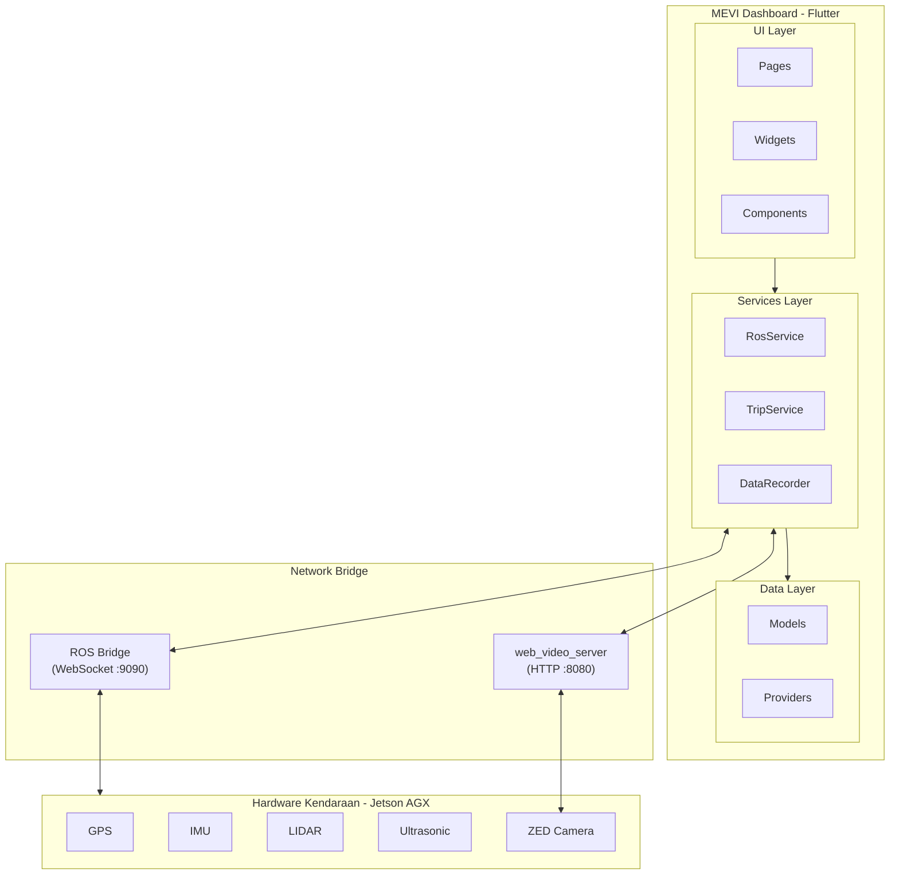
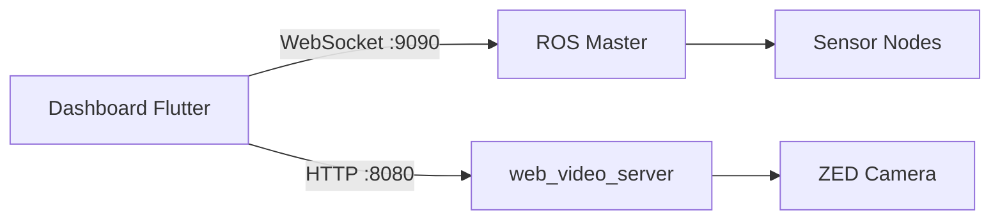
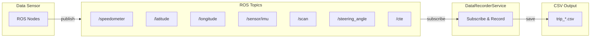
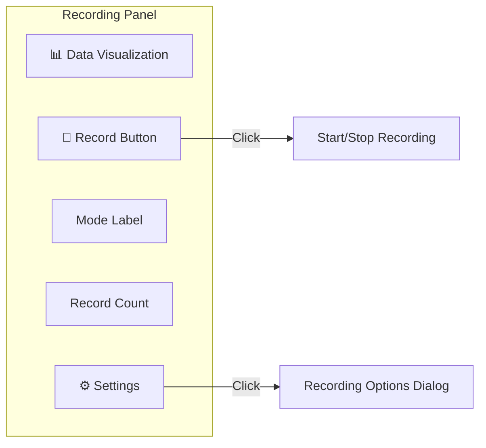

# MEVI Dashboard

Aplikasi dashboard berbasis Flutter untuk platform kendaraan otonom MEVI. Aplikasi ini menyediakan monitoring sensor real-time, navigasi GPS, dan antarmuka kontrol kendaraan.

## 📋 Daftar Isi

- [Fitur Utama](#fitur-utama)
- [Cara Penggunaan](#cara-penggunaan)
- [Instalasi](#instalasi)
- [Arsitektur Sistem](#arsitektur-sistem)
- [Konfigurasi](#konfigurasi)

---

## Fitur Utama

| Fitur | Deskripsi |
|-------|-----------|
| **Monitoring Real-Time** | Speedometer, status baterai, dan pembacaan sensor |
| **Sistem Navigasi** | Navigasi berbasis GPS dengan waypoint following |
| **Rekam Data** | Ekspor CSV semua data sensor untuk analisis |
| **Multi-Platform** | Berjalan di Linux, Android, iOS, Windows, macOS |

---

## Cara Penggunaan

### Langkah 1: Menyalakan Aplikasi

```bash
# Mode Development
flutter run -d linux

# Mode Production (disarankan)
flutter run -d linux --release
```

### Langkah 2: Konfigurasi Data Source

1. Klik tombol **Settings** di panel kiri bawah
2. Pilih **Data Source**:
   - **Live Mode**: Koneksi langsung ke kendaraan MEVI
   - **Rosbag Mode**: Playback data rekaman

3. Masukkan IP Address:
   - **ROS Bridge**: IP kendaraan (contoh: `192.168.1.100`)
   - **Camera Stream**: Otomatis menggunakan `web_video_server` port 8080

4. Klik **Connect**

### Langkah 3: Verifikasi Koneksi

Pastikan indikator berikut aktif:
- 🟢 **WebSocket**: Connected
- 🟢 **Camera**: Live / Streaming
- 🟢 **GPS**: Menerima data latitude/longitude

### Langkah 4: Menentukan Tujuan (Navigasi)

1. Di halaman **Navigation**, klik **Search Bar** di bagian bawah
2. Ketik nama lokasi tujuan (contoh: "KST Samaun Samadikun")
3. Pilih lokasi dari daftar hasil pencarian
4. Dashboard akan menampilkan:
   - Marker tujuan di peta
   - Garis rute dari posisi saat ini ke tujuan
   - Estimasi jarak dan waktu

### Langkah 5: Memulai Navigasi

1. Setelah tujuan dipilih, sistem akan otomatis:
   - Menghitung waypoint optimal
   - Mengirim waypoint ke kendaraan via `/waypoints_array`
   - Mengirim koordinat tujuan via `/destination_coordinate`

2. Kendaraan akan mulai bergerak mengikuti jalur yang ditentukan

3. Pantau progres navigasi:
   - **Halaman Camera**: Lihat video depan kendaraan
   - **Halaman Data**: Lihat grafik steering, CTE, trajectory
   - **Halaman Navigation**: Lihat posisi real-time di peta

### Langkah 6: Saat Mencapai Tujuan

Saat kendaraan mendekati tujuan:
- Notifikasi "Destination Reached" akan muncul
- Kendaraan akan berhenti secara otomatis
- Data perjalanan tersimpan untuk analisis

---

## Instalasi

### Prasyarat

- Flutter SDK >= 3.8.1
- Dart SDK >= 3.8.1
- Docker (opsional, untuk simulasi ROS)

### Langkah Instalasi

```bash
# 1. Clone repository
git clone https://github.com/DavnFs/dashboard-mevi.git
cd dashboard-mevi

# 2. Install dependencies
flutter pub get

# 3. Jalankan aplikasi
flutter run -d linux --release
```

---

## Arsitektur Sistem



---

## Konfigurasi

### ROS Topics

#### Topics yang Disubscribe

| Topic | Tipe | Deskripsi |
|-------|------|-----------|
| `/latitude` | Float64 | Latitude GPS |
| `/longitude` | Float64 | Longitude GPS |
| `/velocity` | Float32 | Kecepatan (m/s) |
| `/scan` | LaserScan | Data LIDAR 2D (ranges, angles) |
| `/sensor/imu` | Imu | Data IMU (yaw, pitch, roll, akselerasi) |
| `/steering_angle` | Float32 | Sudut kemudi kendaraan (derajat) |
| `/cte` | Float32 | Cross-Track Error (meter) |
| `/heading_error` | Float32 | Heading Error (derajat) |
| `/battery_percentage` | Float32 | Persentase baterai |
| `/gear_state` | String | Status gear (P/N/R/D) |

#### Topics Kamera (via web_video_server)

| Topic | Tipe | Deskripsi |
|-------|------|-----------|
| `/zed2i/zed_node/left/image_rect_color` | Image | Stream video kamera ZED |

#### Topics yang Dipublish

| Topic | Tipe | Deskripsi |
|-------|------|-----------|
| `/waypoints_array` | String (JSON) | Waypoint navigasi |
| `/destination_coordinate` | String (JSON) | Koordinat tujuan |
| `/navigation_command` | String | Perintah start/stop/pause |

---

## Mode Penggunaan

### Live Mode (Kendaraan Nyata)



---

### Rosbag Mode (Playback Data Rekaman)

Mode ini digunakan untuk memutar ulang data rekaman dari file `.bag` tanpa memerlukan kendaraan nyata.

#### Langkah 1: Siapkan Docker Environment

```bash
# Buka terminal dan masuk ke folder deployment
cd dashboard-mevi/deployment

# Jalankan semua container Docker
docker-compose -f docker-compose.live.yml up -d
```

Pastikan container berikut berjalan:
- ✅ `mevi-ros-master` - ROS Master
- ✅ `mevi-rosbridge` - WebSocket bridge (port 9090)
- ✅ `mevi-video-server` - Camera stream (port 8080)
- ✅ `mevi-rosbag-player` - Container untuk play rosbag

#### Langkah 2: Siapkan File Rosbag

Letakkan file `.bag` Anda di folder:
```
deployment/rosbags/
```

Contoh struktur:
```
deployment/rosbags/
├── stanleyy_with_camera.bag
├── test_keliling.bag
└── data_uji_coba.bag
```

#### Langkah 3: Play Rosbag

```bash
# Masuk ke container rosbag player
docker exec -it mevi-rosbag-player bash

# Di dalam container, play file rosbag
rosbag play /rosbags/stanleyy_with_camera.bag --loop

# Opsi tambahan:
# --loop        : Putar berulang
# --rate 0.5    : Putar setengah kecepatan
# --rate 2.0    : Putar 2x kecepatan
# --start 30    : Mulai dari detik ke-30
```

#### Langkah 4: Konfigurasi Dashboard

1. Buka aplikasi Dashboard
2. Klik **Settings** di panel kiri
3. Pilih **Data Source** → **Rosbag**
4. Isi konfigurasi:
   - **ROS Bridge**: `localhost` atau `127.0.0.1`
   - **Port**: `9090`
5. Klik **Connect**

#### Langkah 5: Verifikasi Koneksi

Pastikan indikator menunjukkan:
- 🟢 WebSocket: Connected
- 🟢 Camera: Live (streaming dari rosbag)
- 📊 Data sensor mulai terupdate

---

### Dummy Mode (Simulasi Tanpa ROS)

Mode ini digunakan untuk testing UI tanpa memerlukan ROS atau rosbag.

#### Langkah 1: Jalankan Simulator Python

```bash
# Masuk ke folder simulator
cd dashboard-mevi/simulator

# Install dependencies (sekali saja)
pip install numpy

# Jalankan simulator
python3 test.py
```

Simulator akan publish data dummy ke ROS topics.

#### Langkah 2: Alternatif - Simulasi Internal

Dashboard memiliki fallback data dummy ketika tidak ada koneksi ROS:

1. Buka aplikasi Dashboard **tanpa** menjalankan Docker/ROS
2. Dashboard akan otomatis menggunakan data simulasi:
   - Speed: 0 km/h (default)
   - GPS: Posisi default Bandung
   - LIDAR: Data kosong

> **Catatan:** Mode dummy cocok untuk testing UI layout, bukan untuk testing fungsionalitas navigasi.

---

### Perbandingan Mode

| Mode | Kebutuhan | Data | Cocok Untuk |
|------|-----------|------|-------------|
| **Live** | Kendaraan + Sensor | Real-time | Penggunaan sebenarnya |
| **Rosbag** | Docker + File .bag | Rekaman | Testing, demo, analisis |
| **Dummy** | Tidak ada | Simulasi | Testing UI |

---

## Merekam Data Sensor

Fitur **Recording** memungkinkan pengguna merekam seluruh data sensor kendaraan secara real-time dan menyimpannya dalam format **CSV**. 

**Fungsi:**
- Mengumpulkan data GPS, IMU, LIDAR, steering, dan CTE selama perjalanan
- Menyimpan data dengan timestamp untuk analisis waktu

**Hasil:**
- File `trip_YYYY-MM-DD_HH-mm-ss.csv` di folder `MEVI_Recordings/`
- Dapat dibuka dengan Excel, Google Sheets, atau Python pandas

### Arsitektur Data Recording



### Format CSV Output

| Kolom | Tipe | Deskripsi |
|-------|------|----------|
| timestamp | datetime | Waktu perekaman |
| latitude, longitude | double | Koordinat GPS |
| speed_kmh | double | Kecepatan kendaraan |
| steering_angle | double | Sudut kemudi |
| imu_yaw, imu_pitch, imu_roll | double | Orientasi IMU |
| cte_m, heading_error | double | Error navigasi |
| lidar_min, lidar_max | double | Jarak LIDAR |
| obstacle_position | string | Posisi obstacle |

### Data yang Direkam

| Kategori | Data |
|----------|------|
| **GPS** | Latitude, Longitude |
| **Kecepatan** | Speed (km/h) |
| **IMU** | Yaw, Pitch, Roll, Akselerasi X/Y/Z |
| **Navigasi** | Steering Angle, CTE, Heading Error |
| **LIDAR** | Min/Max Range, Point Count, Obstacle Position |

### Langkah 1: Buka Halaman Data

1. Klik menu **Data** di navbar bawah
2. Halaman Data akan menampilkan grafik dan visualisasi sensor

### Langkah 2: Kenali Komponen Recording

Di bagian atas halaman Data, terdapat panel Recording:



**Komponen Panel:**
- **🔴 Record Button**: Mulai/Stop recording (berubah jadi ⏹️ saat aktif)
- **Mode Label**: Menampilkan mode aktif (Manual/Auto/Continuous)
- **Record Count**: Jumlah data point yang direkam
- **⚙️ Settings**: Buka dialog pengaturan

#### Fungsi Tombol:

| Tombol | Ikon | Fungsi |
|--------|------|--------|
| **Record** | 🔴 (Lingkaran merah) | Mulai/Stop recording. Berubah menjadi ⏹️ (kotak) saat recording aktif |
| **Settings** | ⚙️ | Buka dialog pengaturan mode dan interval |
| **Record Count** | [123] | Menampilkan jumlah data point yang sudah direkam |
| **Mode Label** | Manual/Auto/Continuous | Menampilkan mode recording yang aktif |
| **Timer** | 00:05:23 | Menampilkan durasi recording (muncul saat recording) |

### Langkah 3: Konfigurasi Recording (Opsional)

Klik tombol **⚙️ Settings** untuk membuka dialog pengaturan:

#### Mode Recording

| Mode | Ikon | Deskripsi | Kapan Digunakan |
|------|------|-----------|-----------------|
| **Manual** | ✋ | Mulai/stop via tombol Record | Testing, recording sesuai kebutuhan |
| **Auto (Goal)** | 🧭 | Otomatis record saat navigasi ke tujuan | Recording perjalanan navigasi |
| **Continuous** | ∞ | Rekam terus selama terhubung ke kendaraan | Monitoring jangka panjang |

#### Recording Rate

| Rate | Interval | Keterangan |
|------|----------|------------|
| **20 Hz** | 50 ms | Sangat detail, file besar |
| **10 Hz** | 100 ms | Detail, cocok untuk analisis |
| **4 Hz** | 250 ms | Sedang, file medium |
| **2 Hz** | 500 ms | Ringan, file kecil |

### Langkah 4: Mulai Recording

1. Klik tombol **🔴 Record** untuk memulai
2. Indikator akan berubah:
   - Tombol berkedip merah
   - Counter waktu berjalan
   - Jumlah data point tercatat

### Langkah 5: Hentikan Recording

1. Klik tombol **⏹️ Stop** untuk mengakhiri
2. Notifikasi akan muncul dengan informasi:
   - Nama file yang tersimpan
   - Lokasi penyimpanan

### Langkah 6: Akses File Rekaman

File CSV tersimpan di:

| Platform | Lokasi |
|----------|--------|
| **Linux** | `~/Documents/MEVI_Recordings/` |
| **Android** | `/storage/emulated/0/Android/data/.../MEVI_Recordings/` |
| **Windows** | `C:\Users\[User]\Documents\MEVI_Recordings\` |

### Format File CSV

Nama file: `trip_YYYY-MM-DD_HH-mm-ss.csv`

Contoh isi file:
```csv
timestamp,latitude,longitude,speed_kmh,steering_angle_deg,imu_yaw_deg,...
2024-12-18 09:30:00.123,-6.8824,107.6109,15.5,2.3,45.2,...
2024-12-18 09:30:00.223,-6.8824,107.6110,15.7,2.1,45.3,...
```

### Tips Recording

> **💡 Tips:**
> - Gunakan mode **Auto** untuk rekam otomatis saat navigasi
> - Interval **100ms** cocok untuk analisis detail
> - Interval **500ms** cukup untuk monitoring umum
> - File CSV dapat dibuka di Excel, Google Sheets, atau Python pandas

---

## Troubleshooting

| Masalah | Solusi |
|---------|--------|
| WebSocket gagal connect | Cek IP address dan pastikan ROS Bridge jalan |
| Camera tidak muncul | Cek apakah `web_video_server` berjalan di port 8080 |
| GPS tidak update | Pastikan node GPS aktif dan publish ke `/latitude`, `/longitude` |
| Navigasi tidak berjalan | Cek apakah kendaraan menerima waypoint di `/waypoints_array` |

---

## Lisensi

Proyek ini dilisensikan di bawah Lisensi MIT.

## Penulis

**Davin Fausta** - [GitHub](https://github.com/DavnFs)
